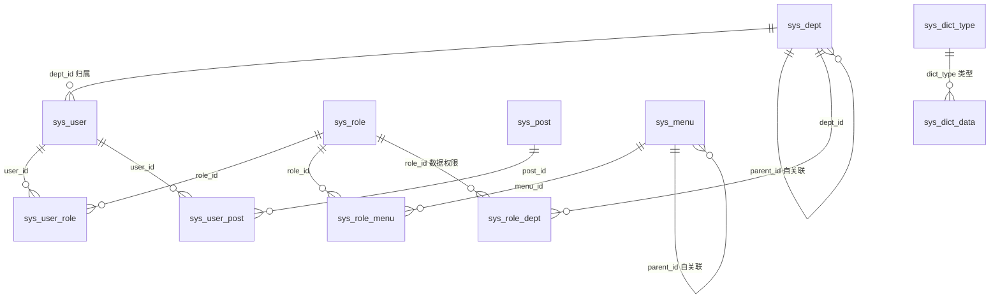
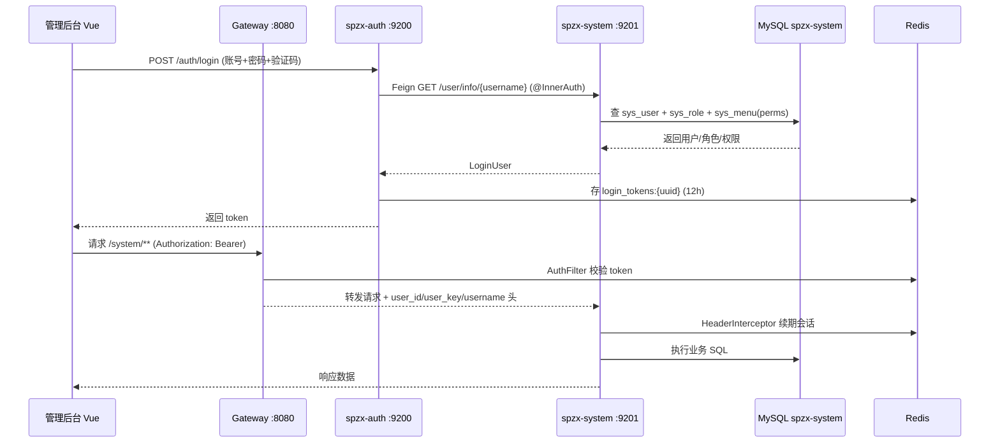

# spzx-system 系统管理服务 — 架构梳理

> 生成时间：2026-08-09　|　模块：`spzx-modules/spzx-system`（端口 9201）
> 数据库：`spzx-system` @ `150.158.27.19:3306`（MySQL 5.7）　|　Redis：`150.158.27.19:6379`（在线用户/会话）
> 技术栈：Spring Boot + Spring Cloud Alibaba + Nacos + MyBatis（XML Mapper）+ Feign + Redis

---

## 1. 服务定位与整体调用关系

```mermaid
flowchart LR
    subgraph Clients["客户端"]
        UI["管理后台 Vue (spzx-ui)"]
        AUTH["认证中心 spzx-auth :9200"]
    end

    subgraph Infra["基础设施"]
        NACOS["Nacos 150.158.27.19:8848<br/>注册中心 + 配置中心"]
        REDIS[("Redis :6379<br/>会话/在线用户")]
        MYSQL[("MySQL :3306<br/>spzx-system 库")]
    end

    GW["网关 spzx-gateway :8080<br/>(AuthFilter 鉴权)"]

    subgraph SYS["★ spzx-system :9201"]
        direction TB
        C_USER["SysUserController<br/>/system/user/**"]
        C_ROLE["SysRoleController<br/>/system/role/**"]
        C_MENU["SysMenuController<br/>/system/menu/**"]
        C_DEPT["SysDeptController<br/>/system/dept/**"]
        C_DICT["SysDict*Controller<br/>/system/dict/**"]
        C_CONFIG["SysConfigController<br/>/system/config/**"]
        C_POST["SysPostController<br/>/system/post/**"]
        C_NOTICE["SysNoticeController<br/>/system/notice/**"]
        C_LOG["Operlog/Logininfor<br/>/system/operlog, /logininfor"]
        C_ONLINE["SysUserOnlineController<br/>/system/online/**"]
        C_PROFILE["SysProfileController<br/>/system/user/profile"]
        C_PROFILE -->|"RemoteFileService Feign"| FILE
    end

    FILE["文件服务 spzx-file :9300<br/>(头像上传)"]

    UI -->|"GET/POST /system/**"| GW
    GW -->|"路由 lb://spzx-system (StripPrefix=1)"| SYS
    AUTH -->|"Feign 内部调用 @InnerAuth"| SYS

    SYS --> NACOS
    SYS --> REDIS
    SYS --> MYSQL
    AUTH --> NACOS
    GW --> NACOS
```

### 调用关系明细

| 方向 | 调用方 | 方式 | 目标端点 | 说明 |
|---|---|---|---|---|
| 入站 | 管理后台 (spzx-ui) | HTTP → 网关 `/system/**` | 各 Controller | 需 JWT 鉴权 + 权限注解 |
| 入站 | spzx-auth | Feign `RemoteUserService` | `GET /user/info/{username}` | 登录时查询用户+角色+权限（`@InnerAuth`） |
| 入站 | spzx-auth | Feign `RemoteUserService` | `POST /user/register` | H5/后台注册（`@InnerAuth`） |
| 入站 | spzx-auth | Feign `RemoteLogService` | `POST /operlog` | 记录操作日志（`@InnerAuth`） |
| 入站 | spzx-auth | Feign `RemoteLogService` | `POST /logininfor` | 记录登录日志（`@InnerAuth`） |
| 出站 | SysProfileController | Feign `RemoteFileService` | spzx-file `POST /file/upload` | 头像上传 |
| 存储 | — | JDBC | MySQL `spzx-system` 库 | 15 张业务表 |
| 存储 | — | Redis | `login_tokens:*` / 在线用户 | 会话刷新、在线统计（无 mapper，Redis 实现） |

---

## 2. 数据表总览（15 张）

| # | 表名 | 说明 | 主键 | 关键外键 |
|---|---|---|---|---|
| 1 | `sys_user` | 用户表 | `user_id` | `dept_id → sys_dept` |
| 2 | `sys_dept` | 部门表（树形） | `dept_id` | `parent_id → sys_dept.dept_id`（自关联） |
| 3 | `sys_role` | 角色表 | `role_id` | — |
| 4 | `sys_menu` | 菜单/权限表（树形） | `menu_id` | `parent_id → sys_menu.menu_id`（自关联） |
| 5 | `sys_post` | 岗位表 | `post_id` | — |
| 6 | `sys_config` | 参数配置表 | `config_id` | — |
| 7 | `sys_dict_type` | 字典类型表 | `dict_id` | — |
| 8 | `sys_dict_data` | 字典数据表 | `dict_code` | `dict_type → sys_dict_type.dict_type` |
| 9 | `sys_notice` | 通知公告表 | `notice_id` | — |
| 10 | `sys_oper_log` | 操作日志表 | `oper_id` | — |
| 11 | `sys_logininfor` | 登录日志表 | `info_id` | — |
| 12 | `sys_user_role` | 用户-角色关联 | `(user_id, role_id)` | 双外键 |
| 13 | `sys_role_menu` | 角色-菜单关联 | `(role_id, menu_id)` | 双外键 |
| 14 | `sys_user_post` | 用户-岗位关联 | `(user_id, post_id)` | 双外键 |
| 15 | `sys_role_dept` | 角色-部门关联（数据权限） | `(role_id, dept_id)` | 双外键 |

---

## 3. ER 图（表关系）

### 关联明细

| 关联 | 类型 | 连接字段 | 用途 |
|---|---|---|---|
| sys_user ↔ sys_dept | N:1 | `user.dept_id = dept.dept_id` | 用户归属部门；数据权限过滤（ancestors 递归） |
| sys_user ↔ sys_role | N:M | `sys_user_role(user_id, role_id)` | 用户角色分配 |
| sys_user ↔ sys_post | N:M | `sys_user_post(user_id, post_id)` | 用户岗位分配 |
| sys_role ↔ sys_menu | N:M | `sys_role_menu(role_id, menu_id)` | 角色权限（菜单/按钮） |
| sys_role ↔ sys_dept | N:M | `sys_role_dept(role_id, dept_id)` | 数据权限范围（`data_scope` 为自定义时生效） |
| sys_dict_type ↔ sys_dict_data | 1:N | `dict_data.dict_type = dict_type.dict_type` | 字典类型→字典项 |
| sys_dept ↔ sys_dept | 自关联 | `dept.parent_id = dept.dept_id` | 部门树 |
| sys_menu ↔ sys_menu | 自关联 | `menu.parent_id = menu.menu_id` | 菜单树/路由 |

---

## 4. 表结构明细

### 4.1 sys_user — 用户表
| 字段 | 类型(推断) | 说明 |
|---|---|---|
| user_id | bigint PK | 用户ID |
| dept_id | bigint FK | 部门ID |
| user_name | varchar | 登录账号 |
| nick_name | varchar | 用户昵称 |
| email | varchar | 邮箱 |
| phonenumber | varchar | 手机号 |
| sex | char(1) | 性别（0男1女2未知） |
| avatar | varchar | 头像地址 |
| password | varchar | 密码（BCrypt） |
| status | char(1) | 状态（0正常1停用） |
| del_flag | char(1) | 删除标志（0存在2删除，逻辑删除） |
| login_ip | varchar | 最后登录IP |
| login_date | datetime | 最后登录时间 |
| create_by / create_time / update_by / update_time | — | 审计字段 |
| remark | varchar | 备注 |

### 4.2 sys_dept — 部门表（树形）
| 字段 | 说明 |
|---|---|
| dept_id (PK) | 部门ID |
| parent_id (FK 自关联) | 父部门ID（0为顶级） |
| ancestors | 祖级列表（如 0,100,101） |
| dept_name | 部门名称 |
| order_num | 显示顺序 |
| leader | 负责人 |
| phone / email | 联系电话/邮箱 |
| status | 状态 |
| del_flag | 删除标志 |
| create_by / create_time / update_by / update_time / remark | 审计/备注 |

### 4.3 sys_role — 角色表
| 字段 | 说明 |
|---|---|
| role_id (PK) | 角色ID |
| role_name | 角色名称 |
| role_key | 角色权限字符串（如 admin） |
| role_sort | 显示顺序 |
| data_scope | 数据范围（1全部2自定义3本部门4本部门及以下5仅本人） |
| menu_check_strictly | 菜单树选择项是否关联显示 |
| dept_check_strictly | 部门树选择项是否关联显示 |
| status / del_flag | 状态/删除标志 |
| create_by / create_time / update_by / update_time / remark | 审计/备注 |

### 4.4 sys_menu — 菜单/权限表（树形）
| 字段 | 说明 |
|---|---|
| menu_id (PK) | 菜单ID |
| parent_id (FK 自关联) | 父菜单ID（0为顶级） |
| menu_name | 菜单名称 |
| order_num | 显示顺序 |
| path | 路由地址 |
| component | 组件路径 |
| query | 路由参数 |
| is_frame | 是否外链（0是1否） |
| is_cache | 是否缓存（0缓存1不缓存） |
| menu_type | 类型（M目录 C菜单 F按钮） |
| visible | 显示状态（0显示1隐藏） |
| status | 菜单状态 |
| perms | 权限标识（如 system:user:list） |
| icon | 菜单图标 |
| create_by / create_time / update_by / update_time / remark | 审计/备注 |

### 4.5 sys_post — 岗位表
`post_id (PK), post_code, post_name, post_sort, status, create_by, create_time, update_by, update_time, remark`

### 4.6 sys_config — 参数配置表
`config_id (PK), config_name, config_key, config_value, config_type(是否系统内置Y/N), create_by, create_time, update_by, update_time, remark`
> 注：`sys.account.registerUser` 注册开关即来自本表。

### 4.7 sys_dict_type — 字典类型表
`dict_id (PK), dict_name, dict_type(唯一类型串), status, create_by, create_time, update_by, update_time, remark`

### 4.8 sys_dict_data — 字典数据表
| 字段 | 说明 |
|---|---|
| dict_code (PK) | 字典编码 |
| dict_sort | 字典排序 |
| dict_label | 字典标签 |
| dict_value | 字典键值 |
| dict_type | 字典类型（FK → sys_dict_type.dict_type） |
| css_class / list_class | 样式属性 |
| is_default | 是否默认（Y/N） |
| status | 状态 |
| create_by / create_time / update_by / update_time / remark | 审计/备注 |

### 4.9 sys_notice — 通知公告表
`notice_id (PK), notice_title, notice_type(1通知2公告), notice_content, status, create_by, create_time, update_by, update_time, remark`

### 4.10 sys_oper_log — 操作日志表
| 字段 | 说明 |
|---|---|
| oper_id (PK) | 日志主键 |
| title | 模块标题 |
| business_type | 业务类型（0其它1新增2修改3删除…） |
| method | 方法名称 |
| request_method | 请求方式（GET/POST…） |
| operator_type | 操作类别（0其它1后台用户2手机端用户） |
| oper_name | 操作人员 |
| dept_name | 部门名称 |
| oper_url | 请求URL |
| oper_ip | 主机地址 |
| oper_param | 请求参数 |
| json_result | 返回参数 |
| status | 操作状态（0正常1异常） |
| error_msg | 错误消息 |
| oper_time | 操作时间 |
| cost_time | 消耗时间（毫秒） |

### 4.11 sys_logininfor — 登录日志表
`info_id (PK), user_name, ipaddr, status(0成功1失败), msg(提示消息), access_time(访问时间)`

### 4.12 关联表（无独立业务字段）
| 表 | 字段 | 说明 |
|---|---|---|
| sys_user_role | user_id, role_id | 用户-角色 |
| sys_role_menu | role_id, menu_id | 角色-菜单 |
| sys_user_post | user_id, post_id | 用户-岗位 |
| sys_role_dept | role_id, dept_id | 角色-部门（数据权限） |

---

## 5. 接口清单（Controller 端点）

### 5.1 外部管理接口（经网关 `/system/**`，需权限）

| Controller | 端点 | 权限标识 |
|---|---|---|
| SysUserController | `GET /user/list`、`POST /user/export`、`POST /user/importData`、`POST /user/importTemplate`、`GET /user/getInfo`、`DELETE /user/{userIds}`、`PUT /user/resetPwd`、`PUT /user/changeStatus`、`GET /user/authRole/{userId}`、`PUT /user/authRole`、`GET /user/deptTree` | system:user:* |
| SysRoleController | `GET /role/list`、`POST /role/export`、`PUT /role/dataScope`、`PUT /role/changeStatus`、`DELETE /role/{roleIds}`、`GET /role/optionselect`、`GET /role/authUser/allocatedList`、`GET /role/authUser/unallocatedList`、`PUT /role/authUser/cancel`、`PUT /role/authUser/cancelAll`、`PUT /role/authUser/selectAll` | system:role:* |
| SysMenuController | `GET /menu/list`、`GET /menu/treeselect`、`DELETE /menu/{menuId}`、`GET /menu/getRouters`（生成动态路由） | system:menu:* |
| SysDeptController | `GET /dept/list`、`GET /dept/list/exclude/{deptId}`、`DELETE /dept/{deptId}` | system:dept:* |
| SysDictTypeController | `GET /dict/type/list`、`POST /dict/type/export`、`DELETE /dict/type/{dictIds}`、`DELETE /dict/type/refreshCache`、`GET /dict/type/optionselect` | system:dict:* |
| SysDictDataController | `GET /dict/data/list`、`POST /dict/data/export`、`DELETE /dict/data/{dictCodes}` | system:dict:* |
| SysConfigController | `GET /config/list`、`POST /config/export`、`DELETE /config/{configIds}`、`DELETE /config/refreshCache` | system:config:* |
| SysPostController | `GET /post/list`、`POST /post/export`、`DELETE /post/{postIds}`、`GET /post/optionselect` | system:post:* |
| SysNoticeController | `GET /notice/list`、`DELETE /notice/{noticeIds}` | system:notice:* |
| SysOperlogController | `GET /operlog/list`、`POST /operlog/export`、`DELETE /operlog/{operIds}`、`DELETE /operlog/clean` | system:operlog:* |
| SysLogininforController | `GET /logininfor/list`、`POST /logininfor/export`、`DELETE /logininfor/{infoIds}`、`DELETE /logininfor/clean`、`GET /logininfor/unlock/{userName}` | system:logininfor:* |
| SysUserOnlineController | `GET /online/list`、`DELETE /online/{tokenId}` | monitor:online:* |
| SysProfileController | `PUT /user/profile/updatePwd`、`POST /user/profile/avatar` | 登录即可 |

### 5.2 内部接口（`@InnerAuth`，仅 Feign 携带 `from-source: inner` 可调）

| 端点 | 调用方 | 功能 |
|---|---|---|
| `GET /user/info/{username}` | spzx-auth `RemoteUserService` | 查询用户 + 角色 + 权限，构造 LoginUser |
| `POST /user/register` | spzx-auth `RemoteUserService` | 注册用户 |
| `POST /operlog` | spzx-auth `RemoteLogService` | 落库操作日志 |
| `POST /logininfor` | spzx-auth `RemoteLogService` | 落库登录日志 |

---

## 6. 核心调用链：登录流程

---

## 7. 关键设计要点

1. **RBAC 权限模型**：用户→角色(N:M)→菜单/按钮权限(N:M)，`perms` 字段配合 `@RequiresPermissions("system:user:list")` 由 `PreAuthorizeAspect` AOP 校验。
2. **数据权限（行级）**：`@DataScope` 注解 + `sys_role_dept` 关联 + `sys_dept.ancestors` 递归查询实现部门级数据过滤。
3. **逻辑删除**：`del_flag`（0存在/2删除），MyBatis-Plus 全局逻辑删除配置（`logic-delete-value: 2`）。
4. **内部接口安全**：`@InnerAuth` 要求 `from-source: inner` 请求头，网关会剥离外部请求的该头防止伪造。
5. **在线用户**：`sys_user_online` 为 Redis 虚拟表（无 mapper），由网关/Auth 写入 `login_tokens:*`，SysUserOnlineController 读取。
6. **动态路由**：`/menu/getRouters` 根据用户权限生成前端路由（RouterVo/MetaVo/TreeSelect）。
7. **配置/字典缓存**：config 与 dict 支持 `refreshCache` 手动刷新 Redis 缓存。
