# SPZX 系统管理后台架构图（图示说明）

> 本文档由系统管理模块架构图整理而成，忠实还原图中的每个节点与标注，并补充对应代码位置。
> 更深度的模块梳理见 [`doc/spzx-system-架构梳理.md`](spzx-system-架构梳理.md)。

---

## 1. 架构图还原（Mermaid）

```mermaid
flowchart LR
    subgraph Client["客户端"]
        UI["管理后台 Vue (spzx-ui)"]
    end

    subgraph Infra["基础设施"]
        NACOS["Nacos 150.158.27.19:8848<br/>注册中心 + 配置中心"]
        REDIS[("Redis :6379<br/>会话 / 在线用户")]
        MYSQL[("MySQL :3306<br/>spzx-system 库")]
    end

    GW["网关 spzx-gateway :8080<br/>GET/POST /system/**<br/>AuthFilter 鉴权"]
    AUTH["认证中心 spzx-auth :9200<br/>Feign 内部调用 @InnerAuth"]
    FILE["文件服务 spzx-file :9300<br/>RemoteFileService Feign（头像上传）"]

    subgraph SYS["spzx-system :9201"]
        direction TB
        C1["SysUserController<br/>/system/user/**"]
        C2["SysProfileController<br/>/system/user/profile"]
        C3["SysRoleController<br/>/system/role/**"]
        C4["SysMenuController<br/>/system/menu/**"]
        C5["SysDeptController<br/>/system/dept/**"]
        C6["SysDict*Controller<br/>/system/dict/**"]
        C7["SysConfigController<br/>/system/config/**"]
        C8["SysPostController<br/>/system/post/**"]
        C9["SysNoticeController<br/>/system/notice/**"]
        C10["Operlog / Logininfor<br/>/system/operlog、/logininfor"]
        C11["SysUserOnlineController<br/>/system/online/**"]
        C2 -->|"RemoteFileService Feign"| FILE
    end

    UI -->|"GET/POST /system/**"| GW
    GW -->|"路由 lb://spzx-system<br/>(StripPrefix=1)"| SYS
    AUTH -->|"Feign 内部调用 @InnerAuth"| SYS

    SYS --> NACOS
    SYS --> REDIS
    SYS --> MYSQL
```

---

## 2. 组件清单

| 组件 | 地址 / 端口 | 图中标注 | 对应代码位置 |
|---|---|---|---|
| 客户端 | — | 管理后台 Vue (spzx-ui) | `spzx-ui/` |
| 网关 | spzx-gateway :8080 | `GET/POST /system/**`、AuthFilter 鉴权、路由 `lb://spzx-system`（StripPrefix=1） | `spzx-gateway/`（AuthFilter、路由配置） |
| 认证中心 | spzx-auth :9200 | Feign 内部调用 `@InnerAuth` | `spzx-auth/`（TokenController / H5TokenController） |
| 系统服务 | spzx-system :9201 | 用户/角色/菜单/部门/字典/配置/岗位/公告/日志/在线用户 | `spzx-modules/spzx-system/` |
| 文件服务 | spzx-file :9300 | RemoteFileService Feign（头像上传） | `spzx-modules/spzx-file/`、`spzx-api/spzx-api-file` |
| Nacos | 150.158.27.19:8848 | 注册中心 + 配置中心 | docker-compose 基础设施 |
| Redis | :6379 | 会话 / 在线用户 | 会话存储、在线统计 |
| MySQL | :3306 | spzx-system 库 | 系统管理业务数据 |

---

## 3. spzx-system 接口清单（图中全部 Controller）

| Controller | 路径 | 职责 |
|---|---|---|
| SysUserController | `/system/user/**` | 用户管理 |
| SysProfileController | `/system/user/profile` | 个人中心（头像上传走 spzx-file） |
| SysRoleController | `/system/role/**` | 角色管理 |
| SysMenuController | `/system/menu/**` | 菜单/权限管理 |
| SysDeptController | `/system/dept/**` | 部门管理 |
| SysDict*Controller | `/system/dict/**` | 字典类型/数据管理 |
| SysConfigController | `/system/config/**` | 参数配置 |
| SysPostController | `/system/post/**` | 岗位管理 |
| SysNoticeController | `/system/notice/**` | 公告管理 |
| Operlog / Logininfor | `/system/operlog`、`/system/logininfor` | 操作日志 / 登录日志 |
| SysUserOnlineController | `/system/online/**` | 在线用户 |

---

## 4. 请求链路说明

1. **客户端 → 网关**：管理后台 Vue (spzx-ui) 发起 `GET/POST /system/**` 请求到网关 `spzx-gateway:8080`。
2. **网关鉴权 + 路由**：`AuthFilter` 完成 JWT 鉴权后，按路由 `lb://spzx-system` 转发，`StripPrefix=1` 去掉 `/system` 前缀。
3. **认证中心内部调用**：`spzx-auth:9200` 通过 Feign 以 `@InnerAuth` 方式调用 spzx-system（登录时查用户/权限、写操作与登录日志）。
4. **文件服务**：`SysProfileController` 通过 `RemoteFileService` Feign 调用 `spzx-file:9300` 完成头像上传。
5. **基础设施**：spzx-system 注册到 Nacos（注册中心 + 配置中心），业务数据落 MySQL `spzx-system` 库，会话/在线用户存 Redis。
